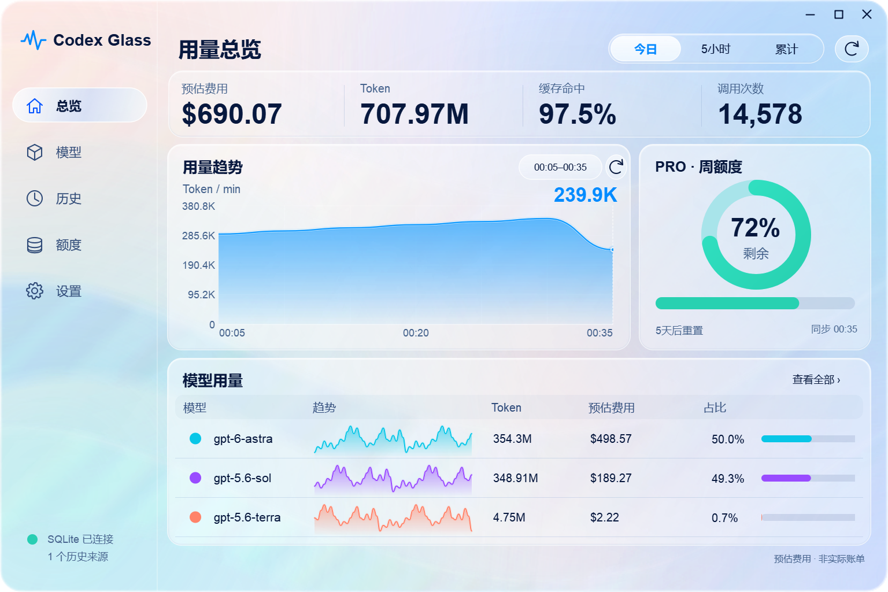
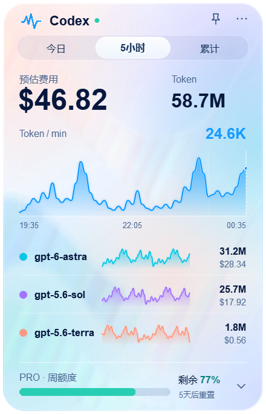
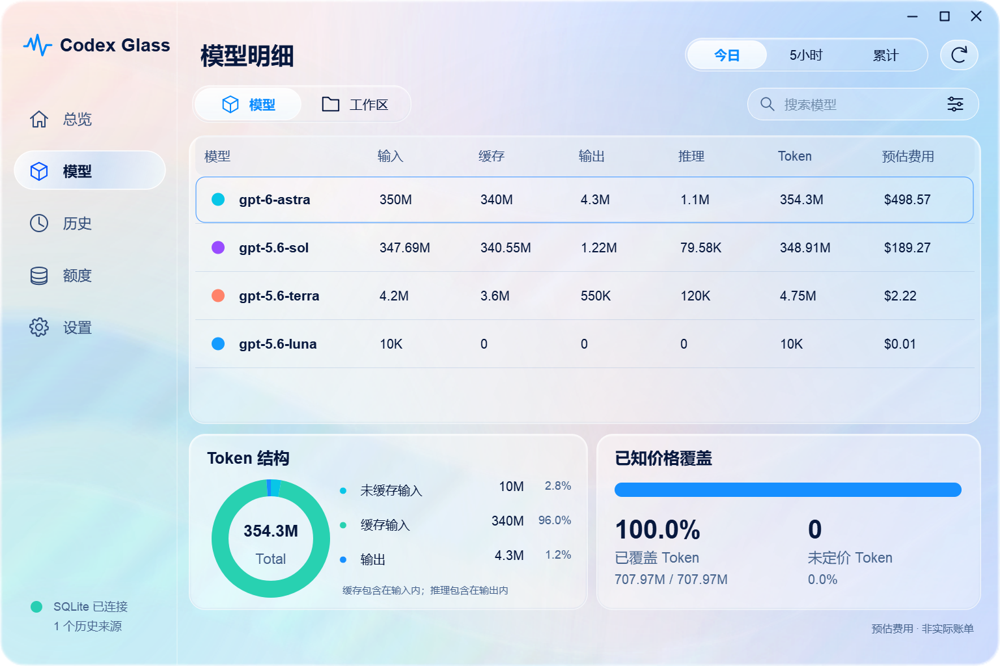
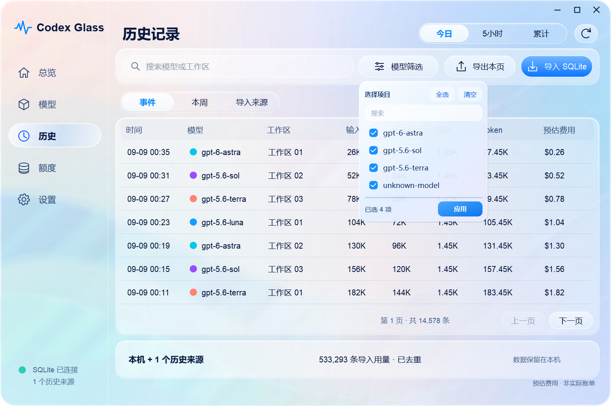
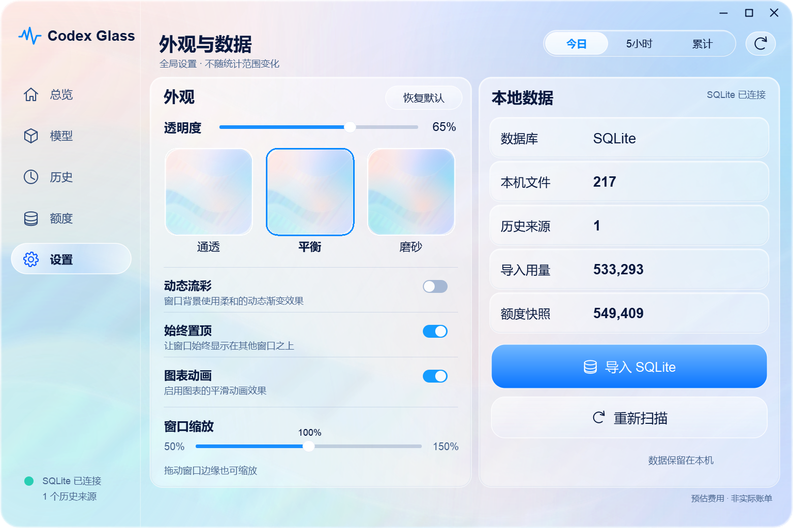

# Codex Glass

**把 Codex 用量，变成桌面上清晰、轻盈的一块玻璃。**

Windows 原生悬浮组件与完整看板。展示模型 Token、美元费用估算及账号额度快照；支持跨电脑 SQLite 历史导入与自动去重。

[下载 Windows EXE](https://github.com/GGBond2424648901/codex-glass/releases/latest) · [使用指南](DESKTOP_GUIDE_zh-CN.md) · [数据与隐私](PRIVACY.md) · [反馈问题](https://github.com/GGBond2424648901/codex-glass/issues)



> 截图由实际 Qt 界面渲染，使用演示数据，不是你的账单，也不是把设计图片贴进程序。窗口外侧透明；流彩、曲线、数字和按钮独立渲染。

## 两种窗口，一套体验

- **桌面组件**：费用、Token、模型趋势、有效额度。默认置顶，支持托盘收起、迷你模式与快捷展开。
- **完整看板**：总览 / 模型 / 历史 / 额度 / 设置，五个页面共享今日 / 5 小时 / 累计三档用量范围。
- **液态玻璃风格**：缓慢流彩、渐变曲线填充、圆角高光、透明度预设与动画开关。
- **窗口缩放**：拖动边缘等比例调整，控件与字体同步缩放。
- **图表探索**：滚轮以鼠标位置为中心缩放时间范围，悬停查看实际采样点，双击复位。
- **原生交互**：玻璃菜单、多选筛选器、详情浮层。完整看板不调用外部浏览器。



## 看什么数据

| 页面 | 信息与操作 |
| --- | --- |
| 总览 | 费用估算、Token、缓存命中、调用次数、趋势、模型占比 |
| 模型 | 按模型或匿名工作区查看输入 / 缓存 / 输出 / 推理，搜索、多选、结构与价格覆盖 |
| 历史 | 时间 / 模型 / 工作区筛选、数值排序、分页、导出本页 CSV、导入 SQLite |
| 额度 | 当前账号有效窗口、剩余百分比、重置时间、快照时间 |
| 设置 | 透明度、预设、流彩 / 图表动画、置顶、窗口缩放、本地数据 |





## 快速开始

### 运行 EXE

从 [Releases](https://github.com/GGBond2424648901/codex-glass/releases) 下载 Windows 包，解压运行 `CodexGlass.exe`。无需 Python 或 Conda。

程序连接本机 `127.0.0.1:8081`，服务不存在时自动启动本地后台。大量历史首次汇总可能需要几十秒，窗口仍可操作。没有记录时显示空状态，不生成假数据。

EXE 未做商业代码签名。请核对 Release 的 `SHA256SUMS.txt`，不要关闭系统安全防护。

### 使用现有 Conda / Python

需要 Python 3.10+，桌面使用 PyQt5，后端只依赖标准库。

```powershell
conda activate <你的已有环境名>
python -m pip install -r requirements-desktop.txt
python desktop_widget.py
```

连接自定义本地服务：

```powershell
python web_dashboard.py --no-browser --port 8082
python desktop_widget.py --url http://127.0.0.1:8082 --no-start-backend
```

保留兼容的 Web / 终端入口，详见 `python monitor.py --help`。

## 数据来源与统计口径

```text
本机 ~/.codex/sessions/**/*.jsonl
              ↓ 增量解析 Token 事实
本地 SQLite ← 另一台电脑的 SQLite（显式导入、自动去重）
              ↓ 当前价格估算 + 紧凑历史分页
       悬浮组件 / 原生完整看板
```

- 使用本工具的 `codex-monitor.sqlite3` 索引，并非任意 Codex 内部 SQLite 都能直接读取。原始 Token 事实来自 `sessions`，不依赖账单 API。
- 费用按当前配置价格重新估算，**不等于订阅实扣或实际账单**。未知价格明确显示“未计价”。
- 缓存包含在输入中，推理包含在输出中，不能重复相加。
- 今日按本机自然日；5 小时回溯当前时间；累计覆盖全部已合并历史。曲线使用五分钟桶 Token/min 或每日 Token，空桶为 0。
- 用量范围不等于账号额度。切换时间范围不改变当前额度或全局设置。
- 当前额度只采用最新有效的**本机**官方 `rate_limits` 快照。按套餐与实际快照显示周 / 五小时窗口；没有或过期的窗口不补造、不假设恢复 100%。
- 原始本机记录可补齐旧索引未保存的套餐或第二窗口。无法访问时只展示可验证的已保存信息。

## 跨电脑历史合并

1. 在旧电脑导出本工具的 SQLite 索引。复制前关闭后台，或使用 SQLite 一致性备份，避免漏掉 WAL。
2. 在完整看板的“历史”或“设置”选择 **导入 SQLite**，选择解压后的 `.sqlite3` / `.sqlite` / `.db`。
3. 确认后校验来源、备份目标、按稳定会话事实去重合并。大文件导入需要时间，可继续使用界面。
4. 重复导入不重复计数；导入历史与本机事实重叠时也会去重。

```powershell
python monitor.py import-index --source-index "D:\history\old-computer.sqlite3"
```

不要手工拼接 SQLite 表，也不要将 `sessions` 与索引视为两份账单相加。其它操作见 `python monitor.py --help`。

## 性能

历史保留在 SQLite，内存中使用紧凑列式数组，仅当前页展开为展示对象。界面请求不包含完整历史。

相同机器、相同 **610,931 条历史副本**、相同统计时刻的后台独立冷测试：

| 指标 | 旧实现 | 紧凑实现 |
| --- | ---: | ---: |
| 峰值 RSS | 2,112 MiB | 472 MiB |
| 汇总后保留 RSS | 1,547 MiB | 117 MiB |
| 冷汇总 | 26.1 秒 | 20.0 秒 |
| 筛选后取 7 条 | 89 ms | 31 ms |

总 Token、调用次数和总估算费用一致。这不是所有机器的 EXE 占用承诺，Qt 界面另有开销。详见 [性能说明](docs/PERFORMANCE.md)。

无新事实且价格未变时复用历史，按分钟时钟更新滚动统计；手动刷新立即安排重算。界面每五秒检查，隐藏窗口停止无用动画及页面重建。检查频率不等于全历史重算耗时。

## 开发与构建

```powershell
python -m pip install -r requirements-desktop.txt
$env:QT_QPA_PLATFORM = 'windows'
python -m unittest discover -s tests -v
python -m pip install pyinstaller==6.22.2
./build_exe.ps1
```

托盘 / 桌面合成测试需要交互式 Windows 桌面。`tests/capture_dashboard.py` 生成 15 个实际页面状态的演示截图；生产界面不加载测试数据。详见 [验收说明](docs/VERIFICATION.md)。

## 限制与隐私

- EXE 面向 Windows x64；其它平台桌面外观尚未完整验收。
- 玻璃为程序绘制的透明漫射材质，不是对桌面内容实施系统级高斯模糊；避免整窗 DWM 背板导致圆角外漏色。
- 动态光影、字体与 DPI 会造成差异，不宣称 AI 设计图与所有机器逐像素完全相同。
- 不提供云同步、实际账单获取或跨账号身份识别。
- 默认只监听本机，不上传记录。仓库 / Release 不含个人 SQLite、会话、日志、令牌或虚拟环境。不要把监控端口暴露到公网。

参见 [PRIVACY.md](PRIVACY.md) 与 [SECURITY.md](SECURITY.md)。

## 许可与致谢

基于 [SC123667/codex-monitor](https://github.com/SC123667/codex-monitor) 的本地监控核心继续开发，保留原作者和贡献者的 [MIT 许可](LICENSE)。本项目不是 OpenAI 官方产品。

桌面发行物包含 PyQt5 / Qt，适用各自许可；分发时须保留许可声明及对应源码获取方式。见 [第三方许可说明](THIRD_PARTY_NOTICES.md)。
